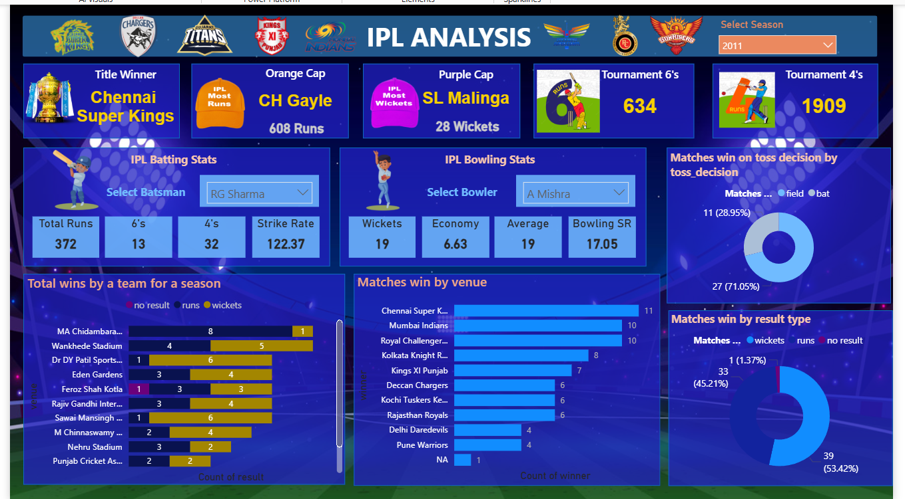

# 🏏 IPL Power BI Dashboard

This project is an interactive **Power BI dashboard** analyzing data from the **Indian Premier League (IPL)** cricket tournament.  
It was built as a learning and portfolio project by following tutorials on YouTube:  
🎥 [Part 1](https://youtu.be/CwsMbz_CF4o) | [Part 2](https://youtu.be/kfTVbJb9yIE)

---

## 📊 Dashboard Preview




---

## 📂 Repository Structure

ipl-powerbi-dashboard/
├── README.md
├── LICENSE
├── dashboard.png
└── ipl_dashboard.pbix

- `ipl_dashboard.pbix` — Power BI dashboard file
- `dashboard.png` — dashboard screenshots
- `README.md` — project documentation
- `LICENSE` — GNU GPL v3.0 License

---

## 🗃️ Dataset

The datasets used in this project are publicly available on Kaggle:  
📊 [IPL Dataset (2008–2025) — by chaitu20](https://www.kaggle.com/datasets/chaitu20/ipl-dataset2008-2025)

It includes:
- `matches.csv` — Match-level data
- `deliveries.csv` — Ball-by-ball delivery data

> Please download the dataset directly from Kaggle if you’d like to recreate or modify the dashboard.

---

## 🚀 Features

✅ IPL seasons analysis  
✅ Team performance trends  
✅ Player statistics  
✅ Toss and match result insights  
✅ Interactive, drill-down charts

---

## 📖 How to Use

1️⃣ Clone the repository:
```bash
git clone https://github.com/seea73/ipl-powerbi-dashboard.git
cd ipl-powerbi-dashboard
```

2️⃣ Download the dataset:
- Visit the [Kaggle dataset page](https://www.kaggle.com/datasets/chaitu20/ipl-dataset2008-2025) and download the CSV files.
- Place `matches.csv` and `deliveries.csv` on your computer.

3️⃣ Open the Power BI file:
- Open `ipl_dashboard.pbix` in **Power BI Desktop**.
- If prompted, reconnect the dataset to the downloaded CSV files on your machine.

4️⃣ Explore and customize the dashboard!

---

## 🎥 Tutorials Followed

- [IPL Dashboard in Power BI | Part 1](https://youtu.be/CwsMbz_CF4o)  
- [IPL Dashboard in Power BI | Part 2](https://youtu.be/kfTVbJb9yIE)

---

## 📝 License

This project is licensed under the GNU General Public License v3.0.  
See the [LICENSE](LICENSE) file for details.

---

## 👤 Author

- [Sheena Patel](https://github.com/seea73)

---

## 🔖 Topics

`powerbi` `ipl` `cricket` `dashboard` `data-visualization` `sports-analytics` `kaggle`
